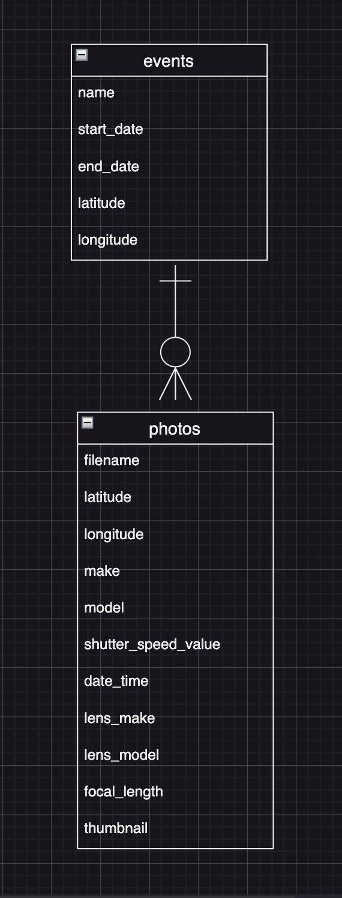

## アプリケーション名
  Life Album

## アプリケーション概要
  写真をカレンダー、地図、Exif情報で整理する。

## URL
  http://13.115.41.63

## テスト用アカウント
  Basic認証  
  ユーザー名：motoi  
  パスワード：773ykk

## 利用方法
  #### イベント登録
  トップ画面の登録ボタンクリックでイベントの登録ができます。
  入力項目はイベント名、イベント開始日時、イベント終了日時、写真をファイル選択ボタンより選択してください。
  登録ボタンクリックで情報が登録されます。
  登録されると、カレンダーにカメラアイコンが表示されます。
  一日の中で複数のイベントが重なるとイベント数を表す数字が
  アイコンの横に表示されます。

  #### イベント一覧表示
  トップ画面のカレンダー内のカメラアイコンをクリックすると右上の
  一覧に日付とその日のイベント名が表示されます。
  また、登録した写真にGPS情報があれば、一覧中のイベント名をクリ
  ックすると下段の地図がその撮影場所に移動してマーカーを表示します。

  ### イベント情報表示
  イベント一覧中のイベントの左横の写真ボタンをクリックすると、新規タブを開きそのイベントに登録された写真が表示されます。
  その写真をクリックして選択すると、以下に拡大された写真とその写真に登録されていたカメラ情報(メーカー、モデル、シャッタースピード、撮影日時、レンズメーカー、レンズモデル、焦点距離)を表示します。また、地図ラジオボタンをクリックすると、地図に切り替わり、その写真が撮影された場所を表示します。(GPS情報があれば)

## アプリケーションを作成した背景
  このアプリケーションは写真好きな人たちのための写真整理アプリです。このアプリで写真を登録すれば、カレンダー、と地図でビジュアルに写真が整理できます。そしてその写真をどのカメラ、レンズを利用して撮影したのかが分かるようになっています。

  #### 実装予定の機能
    検索機能、編集、削除、ダウンロード、ユーザー管理等、スマホやタブレット端末への対応

## データベース設計
#### ER図  

## 画面遷移図  
## 開発環境  
  使用した言語：Ruby on Rails  
  モジュール：simple＿calendar、Google MAP API、Exifr  
## ローカルでの動作方法  
  % git clone https://github.com/roundshape/life_album.git  
  % cd life_album  
  % bundle install  
  % rails db:create  
  % rails db:migrate  
  % rails s  
  http://localhost:3000へアクセス

## 工夫したポイント  
  - カレンダーにsimple_calendar gemを利用、次月前月切り替えに  
    Ajaxを利用して、カレンダー部分だけを更新
  - 地図表示にGoogle MAP APIを利用
  - Exif情報の抽出にExifr gemを利用
## 制作背景  
  私が以前、カメラを趣味にしていて、カレンダーと地図とExif情報を表示でき、写真を管理するアプリが欲しいと思ったことがあったから。  
## 改善点  
  検索機能、編集、削除、ダウンロード、ユーザー管理等、スマホやタブレット端末への対応 
## 制作時間  
  現時点で約2週間