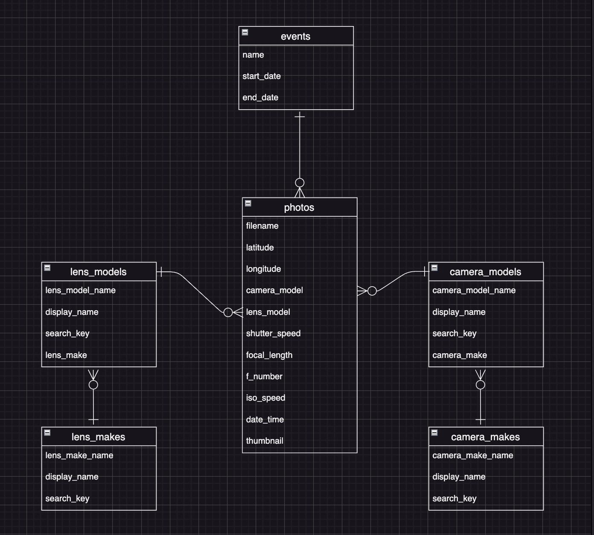
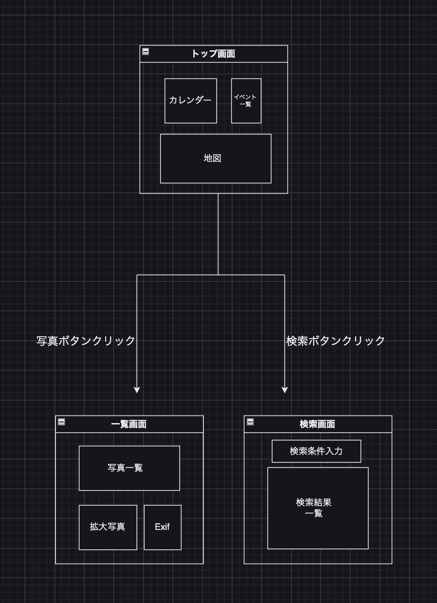

## アプリケーション名
  Life Album

## アプリケーション概要
  このアプリケーションは写真好きな人たちのための写真整理アプリです。このアプリで写真を登録すれば、カレンダー、と地図でビジュアルに写真が整理できます。そしてその写真をどのカメラ、レンズを利用して撮影したのかが分かるようになっています。

## URL
  http://13.115.41.63

## テスト用アカウント
  Basic認証  
  ユーザー名：motoi  
  パスワード：773ykk

## 利用方法
  #### イベント登録
  トップ画面の登録ボタンクリックでイベントの登録ができます。
  入力項目はイベント名、イベント開始日時、イベント終了日時を入力してください。
  登録ボタンクリックで情報が登録されます。
  登録されると、カレンダーにカメラアイコンが表示されます。
  一日の中で複数のイベントが重なるとイベント数を表す数字が
  アイコンの横に表示されます。

  #### イベント一覧表示
  トップ画面のカレンダー内のカメラアイコンをクリックすると右上の
  一覧に日付とその日のイベント名が表示されます。
  一覧中のイベント名をクリックするとクリックしたイベントが反転表示
  になり、現在選択中を意味します。

  #### イベント編集
  編集ボタンをクリックすると選択したイベント名のイベント名、開始日時、終了日時が
  変更するダイアログが表示され、更新できます。

  #### イベント削除
  イベント編集ダイアログには削除ボタンがあり、選択中のイベントを削除できます。
  イベントを削除する場合、そのイベントに登録されている写真も全て削除されます。
  注意を促すダイアログが表示されますので、気おつけてください。

  #### 写真の登録
  イベントを選択し写真ボタンをクリックすると、新規タブを開きそのイベントに登録された写真が表示されます。
  上段のエリアに複数の写真(JPEG)をドラッグ&ドロップすると、写真を登録する事ができます。

  #### 地図上に写真の撮影位置を表示する
  写真の一覧画面で写真をクリックすることで複数の写真が選択できます。
  選択後、マップボタンをクリックすると、その写真の撮影位置が、下段の地図にマーカーが表示されます。

  #### 写真の撮影情報を表示する
  写真(1つの写真)を選択後、詳細ボタンをクリックすると、下段に拡大された写真とその写真の撮影情報(カメラメーカー、カメラモデル、
  シャッタースピード、撮影日時、F値、レンズメーカー、レンズモデル、焦点距離、ISO値)を表示します。

  #### 写真一覧画面で一覧を再描する
  写真一覧画面で再描ボタンをクリックすると一覧を再描します。

  #### 写真一覧画面で選択した写真を削除する
  写真一覧画面で写真を選択した後、削除ボタンクリックで削除します。

  #### 写真検索
  開始日、終了日、イベント名(部分文字列)、カメラメーカー、カメラモデル、レンズメーカー、レンズモデルで検索できます。
  検索条件を入力したら、検索実行ボタンをクリックすると下の一覧に表示されます。
  表示された一覧から１つを選択することができます。選択して写真ボタンをクリックすると、その写真を
  撮影したイベントの写真一覧画面が別タブで表示されます。

## アプリケーションを作成した背景
  私が以前、カメラを趣味にしていて、カレンダーと地図とExif情報を表示でき、写真を管理するアプリが欲しいと思ったことがあったから。 

#### 実装予定の機能
  ダウンロード、ユーザー管理等、スマホやタブレット端末への対応

## データベース設計
  #### ER図  

## 画面遷移図  

## 開発環境  
  使用した言語：Ruby on Rails  
  モジュール：simple＿calendar、Google MAP API、Exifr、Dropzonejs
## ローカルでの動作方法  
  % git clone https://github.com/roundshape/life_album.git  
  % cd life_album  
  % bundle install  
  % rails db:create  
  % rails db:migrate  
  % rails s  
  http://localhost:3000へアクセス

## 工夫したポイント  
  - カレンダーにsimple_calendar gemを利用、次月前月切り替えに  
    Ajaxを利用して、カレンダー部分だけを更新
  - 地図表示にGoogle MAP APIを利用
  - Exif情報の抽出にExifr gemを利用
  - ドラッグ&ドロップによる写真登録を実現 するため、Dropzonejsを利用

## 制作背景
  Javascriptを駆使したアプリを作りたかった
   
## 改善点  
  ダウンロード、ユーザー管理等、スマホやタブレット端末への対応 

## 制作時間  
  現時点で約3週間